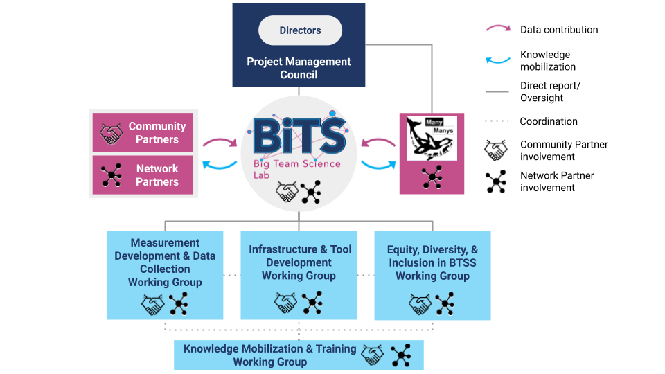

## The Challenge We're Addressing
The replication crisis has shaken public trust in social science. Traditional small-scale studies with unrepresentative samples have produced findings that often fail to replicate. Big Team Social Science offers unprecedented opportunities to enhance research quality through larger sample sizes, standardized methodologies, diverse participants and researchers, and expanded research scope. However, scaling up social science research presents unique challenges that physics or genomics solutions can't address—social behavior varies dramatically across contexts, cultures, and species.

## Our Solution
CONNECT brings together the people best equipped to solve these challenges: those actually conducting BTSS research. Rather than forcing each network to reinvent solutions independently, we create forums to unite expertise, share resources, and collectively improve research practices.

## Our Partners

### Network Partners: 

* [ManyBabies](https://manybabies.org/)
* [ManyBirds](http://themanybirds.com)
* [ManyDogs](https://manydogsproject.github.io)
* [ManyFishes](https://twitter.com/TheManyFishes)
* [ManyPrimates](https://manyprimates.github.io)
* [Psychological Science Accelerator](https://psysciacc.org)
* [Strengthening Democracy Challenge](https://www.strengtheningdemocracychallenge.org)

### Community Partners

* [ABRIR](https://abrirpsy.org/)
* [Canadian Reproducibility Network](https://carn-recar.ca/)
* [Center for Open Science](https://www.cos.io/)
* [Children Helping Science powered by Lookit](https://lookit.mit.edu)

## Our Funding
Activities of CONNECT were originally supported by a [Partnership Development Grant](https://www.sshrc-crsh.gc.ca/funding-financement/programs-programmes/partnership_development_grants-subventions_partenariat_developpement-eng.aspx) and are currently supported by a [Partnership Grant](https://sshrc-crsh.canada.ca/en/funding/opportunities/partnership-grants.aspx), both awarded by the [Social Sciences and Humanities Research Council of Canada](https://www.sshrc-crsh.gc.ca/). You can find our application materials [here](https://osf.io/xavnd/) and [here](https://drive.google.com/file/d/1rzwoVNW7M8pBDB3SBpnh5IqkK-wuebI2/view?usp=drive_link).
